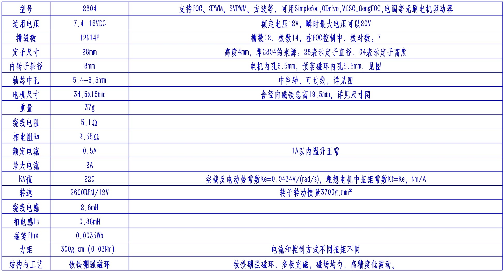
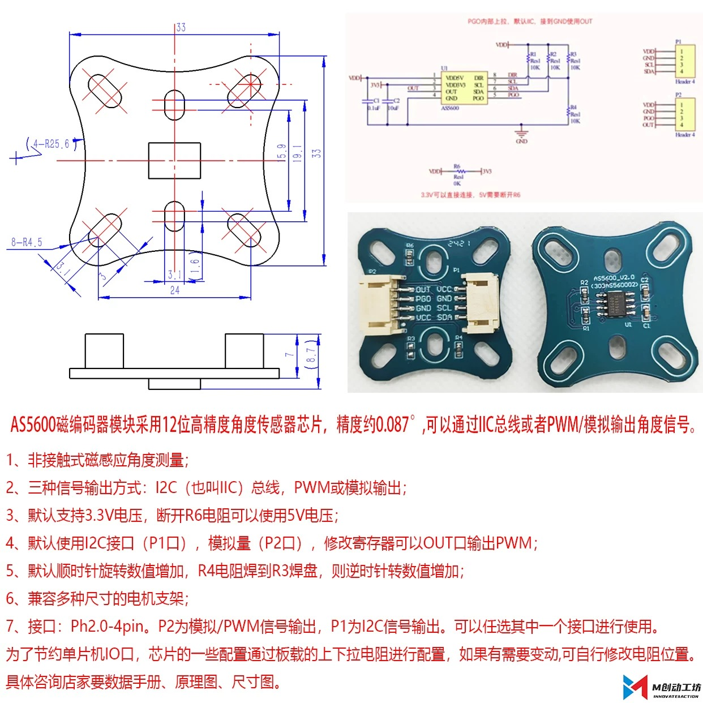
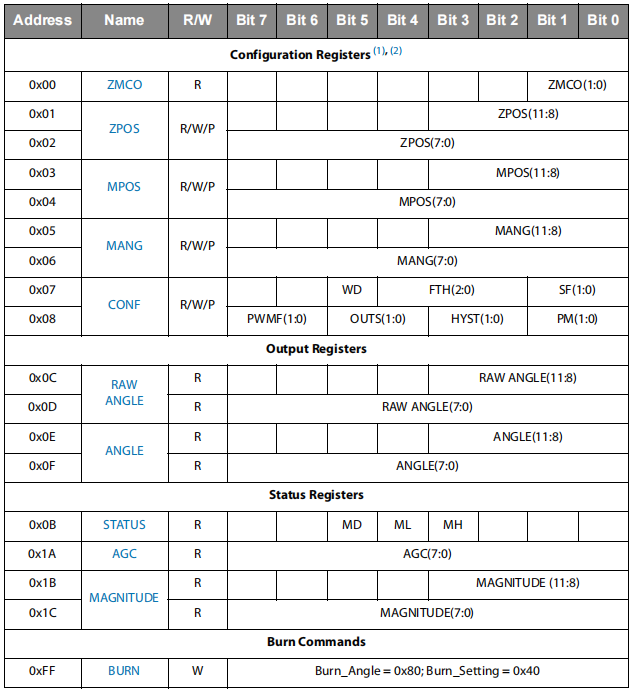
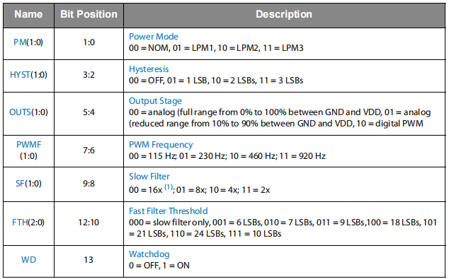
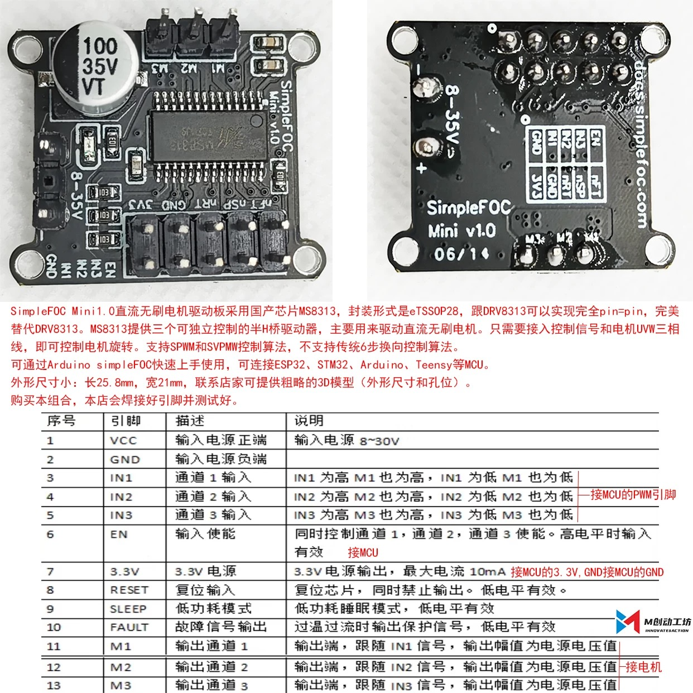
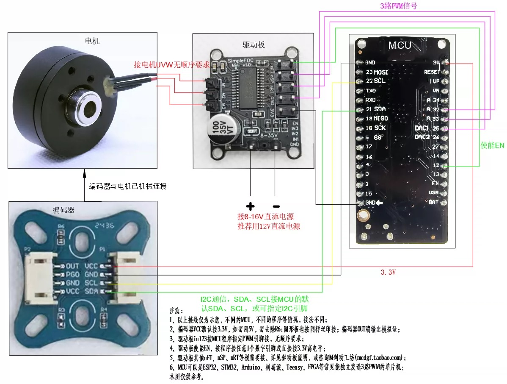

[TOC]
# 项目名称：MotorController
## 1、项目简介

## 2、技术规格
* 2804电机参数

2804电机通常指直径为28毫米、高度（不含轴）为4毫米的无刷直流电机（**BLDC，Brushless Direct Current Motor**），广泛用于微型无人机、穿越机等场景
* AS5600传感器

AS5600是一款性价比极高的磁编码传感器，一般用于电机转动位置的记录，一般采用IIC通讯，也可以用模拟信号获取转动角度。需要注意的是，跟磁编码器配套的磁铁需要径向磁铁，安装距离最好不要超过1mm。
> * 非接触式角度测量
> * 可编程最大角度从 18° 到 360°
> * 12位DAC输出分辨率
> * 输出方式：I2C接口 / PWM / 模拟输出
> * 7位I2C地址：0x36（地址不可配置）

|VDD5V |5V 模式下的正电压供电|
|:----:|:----:|
|VDD3V3	|3.3V 模式下的正电压电源|
|OUT	|模拟/PWM输出|
|PGO	|编程选项（内部上拉，连接到 GND = 编程选项 B）|
|SDA	|I2C 数据|
|SCL	|I2C 时钟|
|DIR	|方向极性（GND = 值顺时针增加，VDD = 值逆时针增加）|

PGO引脚说明：
在 I²C 模式下，GPO 可以配置为：
  PWM 输出：角度值对应占空比。
  模拟电压输出：角度值对应电压 (0–VDD)。
  磁场检测信号（高/低电平）。
  配置方式：通过 CONF 配置寄存器 (0x07) 的 OUTS 位来选择。

在 “无 I²C” 模式下（即不使用 I²C）
  芯片上电后会通过 DIR、OUTS、PWM、GPO 等引脚电平采样来决定工作模式。比如：
  GPO 上电时接高电平 → 芯片进入 数字（PWM）输出模式。
  GPO 上电时接低电平 → 芯片进入 模拟输出模式。

DIR 引脚控制磁铁旋转方向。如果 DIR 连接到 GND （DIR = 0），则从顶部顺时针旋转将产生计算角度的增量。如果 DIR 引脚连接到 VDD （DIR = 1），则计算的角度将逆时针旋转。
**寄存器说明**

常用寄存器有：
CONF（0x07 / 0x08）：配置寄存器

1. `RAW ANGLE（0x0C / 0x0D）`：未缩放/未处理的原始角度数据，12-bit。
2. `ANGLE（0x0E / 0x0F）`：已缩放/处理后的角度寄存器，12-bit。
RAW和ANGLE寄存器的区别：RAW 是芯片内部直接计算得到的无缩放角度；ANGLE 是按 ZPOS/MPOS/MANG（如有编程）以及滤波/死区后的输出值。
3. `STATUS（0x0B）`：状态寄存器，包含磁铁检测位（Magnet Detected，MD）、Magnet Low/High（ML/MH）等位，判断是否检测到合适的磁场（MD=1 表示检测到磁铁）。
4. `AGC（0x1A）`：自动增益控制，表示放大倍数，5V 下范围 0…255，3.3V 下 0…128。可用来补偿因温度变化、IC 与磁体之间的气隙以及磁体性能下降而导致的磁场强度变化。为了获得最稳健的性能，增益值应位于其范围的中间。

典型的径向磁铁感应气隙在 0.5 mm 到 3 mm 之间，这取决于所选的磁体。更大、更强的磁铁允许更大的气隙。以` AGC` 值为指导，通过调整磁体和 AS5600 之间的距离，使 `AGC` 值位于其范围的中心，可以找到最佳气隙。当使用直径为 0.25mm 的磁体时，参考磁体的旋转轴从封装中心的最大允许位移为 6 mm。
5.` MAGNITUDE（0x1B / 0x1C）`：用于判断磁场强弱与是否饱和/过弱。
6.` BURN（0xFF）`：写 0x40 到 0xFF 可做永久写入/OTP，慎重，写入次数有限。
Burn_Angle 命令 (ZPOS, MPOS)：主机微控制器可以使用 BURN_ANGLE 命令对 ZPOS 和 MPOS 进行永久编程。要执行 BURN_ANGLE 命令，请将值 0x80 写入寄存器 0x​​FF。BURN_ANGLE 命令最多可执行 3 次。ZMCO 显示 ZPOS 和 MPOS 已永久写入的次数。此命令仅在检测到磁铁存在 (MD = 1) 时执行。
Burn_Setting 命令 (MANG, CONFIG)：主微控制器可以使用 BURN_SETTING 命令永久写入 MANG 和 CONFIG。要执行 BURN_SETTING 命令，请将值 0x40 写入寄存器 0x​​FF。只有在 ZPOS 和 MPOS 从未被永久写入 (ZMCO = 00) 的情况下，才能写入 MANG。BURN_SETTING 命令只能执行一次。
**数据的换算公式**
> 角度（deg） = raw / 4096.0 * 360.0。raw 为 0…4095（12-bit），即每 LSB ≈ 360/4096 = 0.087890625°。
MCU ADC（12-bit）电压换算：V = ADC_raw / 4095.0 * Vref。其中， ADC_raw为OUT引脚输出的模拟量，Vref为接的供电电压。
* SimpleFOCMini 电机控制板

* 线路连接图

## 3、项目结构
## 4、项目代码
## 4.1 I2C示例代码
`Wire`库可以让`Arduino`与`IIC / TWI`设备进行通信。 与`SPI`总线一样, `IIC`也是主从方式通讯, 因此不能同时存在两个主设备,只能是一个主设备与一个或多个从设备进行通讯
使用之前使用以下语句进行`Wire`库声明:`#include <Wire.h>`
> 一般来说I2C地址有7位和8位的版本。 7位是设备标识码，而第8位则是为了确认设备当前状态是正在写入还是读取;
> Wire库的实现使用了32字节缓冲区，因此任何通信都必须在此限制之内。 单次传输中超出的字节将被丢弃。
**库函数**
```cpp
bool setPins(int sda, int scl);
/**
* @brief address（可选）:7位从机的地址； 如果这个参数未指定，则默认以主机身份加入总线。
*/
bool begin();
bool begin(uint8_t address);
bool begin(int sda, int scl, uint32_t frequency = 0);  // returns true, if successful init of i2c bus
/**
* @brief 由主设备用来向从设备请求字节。请求发送之后可以使用available（）和read（）来接受并读取数据。
* @param address:从机的地址
* @param len:要读取的字节数
* @param stopBit:值为true则在请求后发送停止消息，释放总线。值为 false则在请求后发送重启信息，以保持连接处于活动状态。
*/
size_t requestFrom(uint8_t address, size_t len, bool stopBit) override;
size_t requestFrom(uint8_t address, size_t len) override;

/**
* @brief 使用指定的地址开始向I2C从设备进行传输。在调用了Wire.beginTransmission(address)函数之后，使用write()函数* 对要传输的字节进行队列，并通过调用endTransmission（）进行传输。
* @param address:从机的地址
*/
void beginTransmission(uint8_t address) override;

/**
* @brief 停止与从机的数据传输
* @param stopBit:参数值为true时将在请求后发送停止指令并释放总线;参数值为false时将在请求后发送重新启动的指令，保持连接状态
* @return:byte 返回传输的状态值：
0: 成功
1: 数据量超过传送缓存容纳限制
2: 传送地址时收到 NACK
3: 传送数据时收到 NACK
4: 其它错误
*/
uint8_t endTransmission(bool stopBit) override;
uint8_t endTransmission() override;

/**
* @brief 对于主设备来说: write()将数据进行队列, 用以从主设备传输到从设备, 这个函数通常在beginTransmission（）和endTransmission（）之间进行调用。
* @param data:要写入的数据
* @return:返回值类型 : byte，write()将返回写入的字节数；
*/
size_t write(uint8_t) override;
size_t write(const uint8_t *, size_t) override;

/**
* @brief available() 函数可用于检查是否接收到数据。该函数将会返回等待读取的数据字节数。
应该在调用requestFrom（）之后再在主设备上调用此函数，或者在从设备的onReceive（）的事件处理函数内的调用此函数。
*/
int available() override;

/**
* @brief read() 读取在requestFrom（）调用后从从设备响应发送到主设备的字节，或从主设备发送到从设备的字节
* @return:返回值类型 : 读取的下一个字符，返回值为接读取到的数据流中的1个字符。如果没有数据时，返回值为-1
*/
int read() override;

/**
* @brief setClock() 函数用于设置I2C总线的时钟频率。可接受的值为100000（标准模式）和400000（快速模式）。一些处理器还支持10000（低速模式），1000000（加快速模式）和3400000（高速模式）。请参考特定的处理器文档，以确保支持所需的模式。
1*/
bool setClock(uint32_t freq) override;

/**
* @brief onReceive() 当从设备接收到来自主机的传输时，注册要调用的函数。
*/
void onReceive(const std::function<void(int)> &) override;

/**
* @brief 当主设备请求从从设备发送数据时，从设备通过onRequest设置调用的函数
*/
void onRequest(const std::function<void()> &) override;


```
```cpp
// 主机示例
#include <Wire.h>

#define SDA_PIN 21
#define SCL_PIN 22
#define I2C_FREQ 400000 // 400kHz高速模式

void setup() {
  Serial.begin(115200);
  Wire.begin(SDA_PIN, SCL_PIN, I2C_FREQ); // 指定自定义引脚
  Serial.println("I2C Master Initialized");
}

void loop() {
  // 写入数据到从设备
  Wire.beginTransmission(0x68); // 从设备地址（如MPU6050）
  Wire.write(0x1A);            // 寄存器地址
  Wire.write(0b00000100);      // 配置数据
  if (Wire.endTransmission() == 0) {
    Serial.println("Write success");
  } else {
    Serial.println("Write failed");
  }

  delay(1000);

  // 从从设备读取数据
  Wire.requestFrom(0x68, 6); // 请求6字节数据
  while(Wire.available()) {
    Serial.print(Wire.read(), HEX);
    Serial.print(" ");
  }
  Serial.println();

  delay(2000);
}

//从机示例
#include <Wire.h>

#define SLAVE_ADDR 0x68
#define SDA_PIN 21
#define SCL_PIN 22

void setup() {
  Serial.begin(115200);
  Wire.begin(SLAVE_ADDR, SDA_PIN, SCL_PIN, I2C_FREQ);
  Wire.onReceive(receiveHandler);
  Wire.onRequest(requestHandler);
  Serial.println("I2C Slave Initialized");
}

void loop() {
  delay(100);
}

void receiveHandler(int len) {
  Serial.print("Received: ");
  while(Wire.available()) {
    Serial.print(Wire.read(), HEX);
    Serial.print(" ");
  }
  Serial.println();
}

void requestHandler() {
  // 发送模拟传感器数据
  uint8_t data[6] = {0x00, 0x01, 0x02, 0x03, 0x04, 0x05};
  Wire.write(data, 6);
}

```
## 参考链接
[simplefocdocs](https://docs.simplefoc.com/docs_chinese/)
[SimpleFOC代码](https://github.com/simplefoc/Arduino-FOC)
[官方驱动板](https://docs.simplefoc.com/arduino_simplefoc_library_showcase)
[社区成员开发社区](https://community.simplefoc.com/)
[基于STM32F103驱动AS5600读取磁体旋转的模拟量/角度数据](https://www.cnblogs.com/ljbguanli/p/19226859)
[Arduino – Wire 库](http://www.taichi-maker.com/homepage/reference-index/arduino-library-index/wire-library/)
