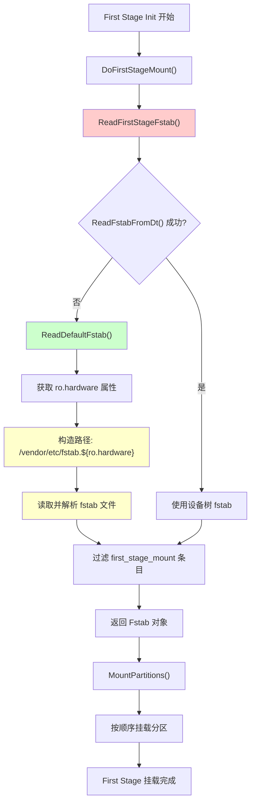

# fstab.${ro.hardware} 文件解析详细分析

## 1. 解析阶段定位

**fstab.${ro.hardware} 文件的解析发生在 First Stage Init 阶段**

### 1.1 具体位置
- **源码文件**: `first_stage_mount.cpp`
- **函数调用链**: `FirstStageMain()` → `DoFirstStageMount()` → `ReadFirstStageFstab()`
- **解析时机**: 在 ramdisk 中执行，Second Stage Init 启动前

### 1.2 阶段详情
```
First Stage Init (ramdisk 中)
├── 挂载基础文件系统 (/proc, /sys, /dev)
├── 初始化 SELinux
├── 加载内核模块
├── 执行 first_stage_mount
│   ├── ReadFirstStageFstab() ← 此处解析 fstab.${ro.hardware}
│   ├── MountPartitions()
│   └── 切换到系统分区
└── execv() → Second Stage Init
```

---

## 2. 解析流程源码分析

### 2.1 ReadFirstStageFstab() 函数

**源码位置**: `first_stage_mount.cpp:159`

```cpp
static Fstab ReadFirstStageFstab() {
    Fstab fstab;
    if (!ReadFstabFromDt(&fstab)) {           // 优先从设备树读取
        if (ReadDefaultFstab(&fstab)) {       // 从默认 fstab 文件读取
            fstab.erase(std::remove_if(fstab.begin(), fstab.end(),     
                                       [](const auto& entry) {
                                           return !entry.fs_mgr_flags.first_stage_mount;
                                                                                             }),
                        fstab.end());        // 过滤出 first_stage_mount 标记的条目
        } else {
            LOG(INFO) << "Failed to fstab for first stage mount";      
        }
    }
    return fstab;
}
```

### 2.2 ReadDefaultFstab() 函数

**实现位置**: `system/core/fs_mgr/libfstab/fstab.cpp`

**解析逻辑**:
1. 获取 `ro.hardware` 属性值
2. 构造 fstab 文件路径: `/vendor/etc/fstab.${ro.hardware}`
3. 读取并解析 fstab 文件内容
4. 将每行解析为 FstabEntry 结构体

**文件路径示例**:
- 如果 `ro.hardware = qcom`: `/vendor/etc/fstab.qcom`
- 如果 `ro.hardware = mt6765`: `/vendor/etc/fstab.mt6765`

### 2.3 fstab 文件格式

```
# 注释行
<source>    <mount_point>    <fs_type>    <mount_flags>    <fs_mgr_flags>
/dev/block/bootdevice/by-name/system    /system    ext4    ro,barrier=1    wait,avb=vbmeta,first_stage_mount
/dev/block/bootdevice/by-name/vendor    /vendor    ext4    ro,barrier=1    wait,avb,first_stage_mount
/dev/block/bootdevice/by-name/odm       /odm       ext4    ro,barrier=1    wait,avb,first_stage_mount
/dev/block/bootdevice/by-name/product   /product   ext4    ro,barrier=1    wait,avb,first_stage_mount
```

**关键字段说明**:
- `first_stage_mount`: 标记该分区需要在 First Stage 挂载
- `wait`: 等待设备节点就绪
- `avb`: 使用 AVB 验证
- `vbmeta`: 关联的 vbmeta 分区

---

## 3. 解析时序图



---

## 4. 关键源码片段

### 4.1 DoFirstStageMount 调用

**位置**: `first_stage_init.cpp:302`

```cpp
if (!DoFirstStageMount()) {
    LOG(FATAL) << "Failed to mount required partitions early ..."; 
}
```

### 4.2 DoFirstStageMount 实现

**位置**: `first_stage_mount.cpp:800`

```cpp
bool DoFirstStageMount() {
    // Skips first stage mount if we're in recovery mode.
    if (IsRecoveryMode()) {
        LOG(INFO) << "First stage mount skipped (recovery mode)";      
        return true;
    }

    std::unique_ptr<FirstStageMount> handle = FirstStageMount::Create();
    if (!handle) {
        LOG(ERROR) << "Failed to create FirstStageMount";
        return false;
    }
    return handle->DoFirstStageMount();  // 调用类的成员函数
}
```

### 4.3 FirstStageMount::DoFirstStageMount

**位置**: `first_stage_mount.cpp:244`

```cpp
bool FirstStageMount::DoFirstStageMount() {
    if (!IsDmLinearEnabled() && fstab_.empty()) {
        // Nothing to mount.
        LOG(INFO) << "First stage mount skipped (missing/incompatible/empty fstab in device tree)";
        return true;
    }

    if (!InitDevices()) return false;

    if (!MountPartitions()) return false;  // 实际挂载逻辑

    return true;
}
```

### 4.4 FirstStageMount 构造函数

**位置**: `first_stage_mount.cpp:231`

```cpp
FirstStageMount::FirstStageMount(Fstab fstab) : need_dm_verity_(false), fstab_(std::move(fstab)) {
}
```

### 4.5 FirstStageMount::Create 工厂方法

**位置**: `first_stage_mount.cpp:235`

```cpp
std::unique_ptr<FirstStageMount> FirstStageMount::Create() {       
    auto fstab = ReadFirstStageFstab();  // ← 此处调用读取 fstab
    if (fstab.empty()) {
        return nullptr;
    }
    
    // 根据 AVB 版本创建不同的实现类
    if (IsDtVbmetaCompatible(fstab)) {
        return std::make_unique<FirstStageMountVBootV2>(std::move(fstab));
    } else {
        return std::make_unique<FirstStageMountVBootV1>(std::move(fstab));
    }
}
```

---

## 5. 解析优先级

1. **设备树 fstab** (ReadFstabFromDt)
   - 优先级最高
   - 从设备树节点 `/fstab` 读取
   - 新设备通常使用此方式

2. **默认 fstab 文件** (ReadDefaultFstab)
   - 备选方案
   - 路径: `/vendor/etc/fstab.${ro.hardware}`
   - 传统设备使用此方式

3. **回退处理**
   - 如果都失败，记录日志但不致命
   - 某些设备可能不需要 First Stage 挂载

---

## 6. 调试信息

### 6.1 日志输出

```bash
# 查看 init 启动日志
adb shell dmesg | grep -i fstab
adb shell logcat | grep -i first.stage

# 查看 ro.hardware 属性
adb shell getprop ro.hardware

# 查看 fstab 文件内容
adb shell cat /vendor/etc/fstab.$(getprop ro.hardware)
```

### 6.2 常见问题排查

1. **fstab 文件不存在**
   ```
   LOG(INFO) << "Failed to fstab for first stage mount";
   ```

2. **ro.hardware 属性未设置**
   - 检查设备树配置
   - 检查属性服务初始化

3. **first_stage_mount 标记缺失**
   - 检查 fstab 文件中的 fs_mgr_flags 字段
   - 确保关键分区有 `first_stage_mount` 标记

---

## 7. 版本差异

- **Android 8.0 之前**: fstab 通常在 rootfs 中
- **Android 8.0-10**: 开始使用 fstab.${ro.hardware}
- **Android 11+**: 继续使用，但增加了设备树支持
- **Android 12+**: 可能进一步向设备树迁移

---

## 8. 总结

`fstab.${ro.hardware}` 文件的解析是 Android 启动过程中至关重要的一步，它：

1. **发生在 First Stage Init 阶段**，在 Second Stage Init 之前
2. **由 `ReadFirstStageFstab()` 函数负责读取**
3. **路径为 `/vendor/etc/fstab.${ro.hardware}`**
4. **只处理标记为 `first_stage_mount` 的分区条目**
5. **为后续的系统分区挂载提供配置信息**

理解这个解析过程有助于调试设备启动问题，特别是分区挂载相关的故障。