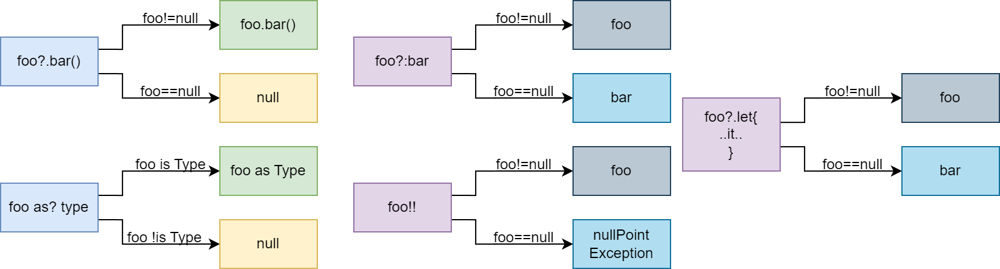

[TOC]
# 1. 概述
Kotlin 是一种编程语言被世界各地的 `Android` 开发者广泛使用。

# 2. 变量
Kotlin 使用两个不同的关键字（即 `val` 和 `var`）来声明变量。
   * val 用于值从不更改的变量。使用 val 声明的变量无法重新赋值
   * var 用于值可以更改的变量。
在以下示例中,`count` 是一个 `Int` 类型的变量,初始赋值为 `10`:
```Java
var count: Int = 10
val a: Int = 10
a = a * 10  //error
```
`Int` 是一种表示整数的类型,是可以用 `Kotlin` 表示的众多基础类型之一。与其他语言类似,您还可以使用 `Byte`、`Char`、`Short`、`Long`、`Float` 、`Double`和`Boolean`,具体取决于您的变量数据类型。
`var` 关键字表示可以根据需要为 `count` 重新赋值。例如,可以将 `count` 的值从 `10` 更改为 `15`
```Java
var count: Int = 10
count = 15
```
不过,有些值不应更改。假设有一个名为 `languageName` 的 `String`。如果希望确保 `languageName` 的值始终为`“Kotlin”`,则可以使用 `val` 关键字声明 `languageName`:

**Kotlin 编译器可根据所赋值的类型来推断变量类型。**
```Java
val languageName = "Kotlin"//自动推断languageName类型为String
val upperCaseName = languageName.toUpperCase()

// Fails to compile
languageName.inc()
```
# 3. 条件语句
Kotlin 提供了几种实现条件逻辑的机制,如:`if-else`,`when`。
## 3.1 if 语句
`Kotlin`中的`if`语句相比于`Java`有一个额外的功能,它是可以有**`返回值`**的,返回值就是`if`语句每
一个条件中最后一行代码的返回值。
```Java
fun largerNumber(num1: Int, num2: Int): Int {
    return if (num1 > num2) {
        num1
    } else {
        num2
    }
}

//!当一个函数只有一行代码时,可以省略函数体部分
fun largerNumber(num1: Int, num2: Int) = if (num1 > num2) {
    num1
} else {
    num2
}
```
## 3.2 when条件语句
`Kotlin`中的`when`语句有点类似于`Java`中的`switch`语句,但它又远比`switch`语句强大得多。`when`语句和`if`语句一样,也是可以有返回值的,因此我们仍然可以使用单行代码函数的语法糖。
```Java
//格式：
匹配值 -> { 执行逻辑 }
//如:
fun getScore(name: String) = when (name) {
    "Tom" -> 86
    "Jim" -> 77
    "Jack" -> 95
    "Lily" -> 100
    else -> 0
}
//除了精确匹配之外,when语句还允许进行类型匹配
fun checkNumber(num: Number) {
    when (num) {
        is Int -> println("number is Int")
        is Double -> println("number is Double")
        else -> println("number not support")
    }
}
```
>⚠️:when 语句不需要在每一个分支上通过`break`跳出函数块。
### 3.2.1 在"when"结构中使用任意对象
`Kotlin `中的`when`结构相比`Java`中的`switch` 强大很多,`switch`要求必须使用常量(枚举常量、字符串或数字)作为分支条件,而`when`语句可以使用任意对象。
```Java
fun mix(c1:COLOR,c2:COLOR){
    when(setOf(c1,c2)){
        setOf(COLOR.RED,COLOR.GREEN)-> println("red and green")
        setOf(COLOR.RED,COLOR.BLUE)-> println("red and blue")
        setOf(COLOR.BLUE,COLOR.YELLOW)-> println("blue and yellow")
        else ->throw Exception("Dirty Color")
    }
}
mix(COLOR.RED,COLOR.BLUE)
```
### 3.2.2 when类层次结构
实现类似Number类的效果,可以根据不同数据类型执行对应逻辑
```Java
interface Expr //声明空接口Expr
class Num(val value:Int):Expr//实现空接口
class Sum(val left:Expr,val right:Expr):Expr//实现空接口
fun eval(e:Expr){
    when(e){
        is Num-> println("is Num")
        is Sum-> println("is Sum")
        else -> throw Exception("not Num or Sum")
    }
}
eval(Sum(Num(1),Num(2)))
```
---
## 3.3 循环语句
`Kotlin`提供了`while`循环和`for`循环。
### 3.3.1 while 循环和
`Kotlin` `while` 循环和 `do-while` 循环,它们的语法和 Java 中相应的循环没有什么区别
```Java
while(condition){
    ...
}
do{
    ...
}while(condition)
```
### 3.3.2 for 循环
```Java
fun main() {
    for (i in 0..10) {  //!区间范围是[0,10]
        println(i)
    }

    val range=0 until 10//!区间范围是[0,10)
    //使用until替代..关键字,step 指定步长
    for (i in 0 until 10 step 2) {
        println(i)
    }
}
```
`until` 与 `..` 关键字只能用于**升序区间**,**降序区间**需要使用`downTo`。

```Java
fun main() {
    for (i in 10 downTo 1) {
        println(i)
    }
}
```
除了`in` 运算符还有`!in` 运算符,用于表示不在某一个区间,同样也适用于`when` 表达式。
```Java
fun isNotDigit(c: Char) = c !in '0'..'9'
println(isNotDigit('8'))

fun recognize(c:Char)=when(c){
    in '0'..'9'->"It's a digit!"
    in 'a'..'z',in 'A'..'Z'->"It's is letter!" //多个条件中间使用','隔开
    else->"I don't know"
}
println(recognize('x'))
```
# 4. 函数
## 4.1 函数声明
要声明函数,请使用 `fun` 关键字,后跟函数名称。接下来,定义函数接受的输入类型（如果有）,并声明它返回的输出类型;<u>**当一个函数中只有一行代码时,Kotlin允许我们不必编写函数体,可以直接将唯一的一行代码写
在函数定义的尾部,中间用等号连接即可**</u>。
```Java
fun generateAnswerString(): String {
    val answerString = if (count == 42) {
        "I have the answer."
    } else {
        "The answer eludes me"
    }

    return answerString
}
// 简化如下
fun generateAnswerString(countThreshold: Int): String = if (count > countThreshold) {
        "I have the answer"
    } else {
        "The answer eludes me"
    }
```
## 4.2 默认参数
在Kotlin中可以声明函数时指定默认参数,这样可以避免创建重载函数;
```Java
fun getProperty(key:String,value:String=""){//默认参数为空
    //...
}
```
---

# 5. 类与对象
## 5.1 类定义
可以使用 `class` 关键字来定义类,不过`Kotlin`的声明默认是 `final public`如以下示例所示:
```Java
class Person{
    var name = ""
    var age:Int = 0
    fun eat(){
        println("$name is eating. He is $age years old.")
    }
}
val p = Person()

class Person(val name:String,val age:Int){ //这样会生成Person对象的name和age字段
    fun dump(){
        println("name $name age:$age")
        println("name ${this.name} age:${this.age}")
    }
}
//等同于
class Person(){
    val name = ""
    val age = 0
    fun eat(){
        println("$name is eating. He is $age years old.")
    }
    fun dump(){
        println("name $name age:$age")
        println("name ${this.name} age:${this.age}")
    }
}

class Person(var name:String, var age:Int){
    fun dump(){
        println("name $name age:$age")
        println("name ${this.name} age:${this.age}")
    }
    fun updateName(name: String){ //需要修改name,所以构造函数使用var声明name
        this.name=name
    }
    fun updateAge(age: Int){//需要修改age,所以构造函数使用var声明age
        this.age=age
    }
}

fun main(){
    val p=Person("zhangsan",20);
    p.dump()
    p.updateAge(21)
    p.updateName("lisi")
    p.dump()
}
```
## 5.2 继承
`Kotlin` 的类默认为`final` 类,无法继承;需要继承的类使用open关键字声明;

```Java
open class Person {//open 声明类可以继承
    //...
}
class Student : Person() {
    var sno = ""
    var grade = 0
}
//带参数继承
open class Person(val name:String,val age:Int){
    //...
}
class Student(val sno:String,val grade:Int,name:String,age:Int):Person(name,age){
    //...
}
```
⚠️注意：我们在Student类的主构造函数中增加声明父类构造参数时，不需要添加`val`或`var`限定，**因为在主构造函数中声明成`val`或者`var`的参数将自动成为该类的字段，这就会导致和父类中同名的`name`和`age`字段冲突**。因此，这里的`name`和`age`参数前面不需要增加任何关键字，让它的作用域仅限定在主构造函数当中即可。

如果你想允许创建一个类的子类,需要使用 `open`修饰符来标示这个类。此外,需要给**每一个可以被重写的属性或方法**添加`open`修饰符。
```Java
open class View{
    open val name:String //open 标识,子类可以继承
        get() {
            return this.name
        }
    open fun onClicked(){ //open 标识,子类可以继承
        println("View onClicked")
    }
}
class Button: View() {
    override val name: String
        get() = name+"_"

    override fun onClicked() {
        println("Button Clicked")
    }
}
```
如果你重写了一个基类或者接口的成员,**重写了的成员同样默认是`open`** 如果你想改变这行为,阻止你的类的子类重写你的实现,可以显式地将重写的成员标注为`final`
```Java
class Button: View() {
    override val name: String
        get() = name+"_"

    final override fun onClicked() { //final 声明后,方法不能再被继承
        println("Button Clicked")
    }
}
```
## 5.3 构造函数
Kotlin将构造函数分成了两种:**主构造函数**和**次构造函数**，类可以有一个主构造函数和多个次构造函数；
### 5.3.1 主构造函数
```Java
class Person(val name: String, val age: Int)
//class Person(){} 冲突
fun main(){
    val p=Person("zhangsan",25)
    println(p.name)
    println(p.age)
    //zhangsan
    //25
}

```
### 5.3.2 初始化代码块
`init` 块用于类的初始化时执行代码:
```Java
class Person(val name: String, val age: Int) {
    init {
        println("Person initialized with name: $name and age: $age")
    }
}


```
### 5.3.3次构造函数
如果类需要多个构造函数，可以定义次构造函数；
```Java
class Person {
    var name: String
    var age: Int

    constructor(name: String) {//参数类型1
        this.name = name
        this.age = 0
    }

    constructor(name: String, age: Int) {//参数类型2
        this.name = name
        this.age = age
    }
}

fun main() {
    val person1 = Person("Alice")
    val person2 = Person("Bob", 30)
}

```
⚠️:**如果类有主构造器，则每个次构造器需要委托给主构造器**
即，当一个类中既有主构造函数又有次构造函数时，次构造函数必须调用主构造函数（包括间接调用）。
```Java
class Student(val sno: String, val grade: Int, name: String, age: Int) : Person(name, age) {
    constructor(name: String, age: Int) : this("", 0, name, age) {
    }
    constructor() : this("", 0) {}
}
```
这里定义了两个次构造函数：第一个次构造函数接收`name`与`age`参数，然后它通过`this`关键字调用了**主构造函数**，并将`sno`和`grade`参数赋值为默认值`""`和`0`；第二个次构造函数没有参数，它通过`this`关键字调用了第一个次构造函数，将`name`和`age`参数赋值为默认值`""`和`0`，第二个次构造函数间接调用了主构造函数，所以它不需要再调用主构造函数。
## 5.4 接口
```Java
interface Study {
    fun readBooks()
    fun doHomework()
}

open class Person(val name: String, val age: Int){
    fun eat(){
        println("$name is eating. He is $age years old.")
    }
}
//类的继承与接口的实现都使用的":",中间使用","隔开
class Student(name: String, age: Int) : Person(name, age), Study {
    override fun readBooks() {
        println(name + " is reading.")
    }
    override fun doHomework() {
        println(name + " is doing homework.")
    }
}
```
Kotlin 的接口相比Java接口具有的优势是,允许接口具有**默认实现**以及接口支持属性;
```Java
interface Study {
    val book:String
    fun readBooks()
    fun doHomework(){
        println("default method of doHomework")
    }
}
```
## 5.5 类的状态
类状态分为public、private、protected、default以及internal;
<style>
.center
{
  width: auto;
  display: table;
  margin-left: auto;
  margin-right: auto;
}
</style>
<div class="center">

|修饰符|Java|Kotlin|
|:------:|:------:|:------:|
|public|所有类可见|所有类可见（默认）|
|private|当前类可见|当前类可见|
|protected|当前类、子类,同一包下的类可见|当前类、子类可见|
|default|同一包下的类可见（默认）|无|
|internal|无|同一模块中的类可见|

</div>

## 5.6 数据类
在一个规范的系统架构中,数据类通常占据着非常重要的角色,它们用于将服务器端或数据库中的数据映射到内存中,为编程逻辑提供数据模型的支持;数据类通常需要重写`equals()`、`hashCode()`、`toString()`这几个方法。其中,`equals()`方法用于判断两个数据类是否相等。`hashCode()`方法作为`equals()`的配套方法,也需要一起重写,否则会导致`HashMap`、`HashSet`等`hash`相关的系统类无法正常工作。`toString()`方法用于提供更清晰的输入日志,否则一个数据类默认打印出来的就是一行**内存地址**
```Java
public class Cellphone {
    String brand;
    double price;
    public Cellphone(String brand, double price) {
        this.brand = brand;
        this.price = price;
    }
    @Override
    public boolean equals(Object obj) {
        if (obj instanceof Cellphone) {
            Cellphone other = (Cellphone) obj;
            return other.brand.equals(brand) && other.price == price;
        }
        return false;
    }
    @Override
    public int hashCode() {
        return brand.hashCode() + (int) price;
    }
    @Override
    public String toString() {
        return "Cellphone(brand=" + brand + ", price=" + price + ")";
    }
}
//Kotlin简化如下
data class Cellphone(val brand: String, val price: Double)
fun main() {
    val cellphone1 = Cellphone("Samsung", 1299.99)
    val cellphone2 = Cellphone("Samsung", 1299.99)
    println(cellphone1)
    println("cellphone1 equals cellphone2 " + (cellphone1 == cellphone2))
}
```
## 5.7 单例类
在Kotlin中创建一个单例类的方式极其简单,只需要将`class`关键字改成`object`关键字即可
```Java
object Singleton {
    fun singletonTest() {
        println("singletonTest is called.")
 }
}
Singleton.singletonTest()
```
## 5.8 枚举类
Kotlin使用`enum class`两个关键字标识枚举类;

```Java
fun getColorInfo(color:COLOR){
    when(color){
        COLOR.RED-> println("Red")
        COLOR.BLUE-> println("Blue")
        else-> println("other")
    }
}
```
和Java 样,枚举并不是值的列表,可以给枚举类声明属性和方法。

```Java
enum class COLOR(val r:Int,val b:Int,val g:Int){
    RED(255,0,0),
    BLUE(0,255,0),
    GREEN(0,0,255),
    YELLOW(255,255,0);//最后一个元素必须使用;
    fun rgb(){
        (r*256+g)*256+b
    }
}
println("Color r: ${COLOR.RED.r} g:${COLOR.RED.g} b:${COLOR.RED.b} "+COLOR.RED.rgb())
```
## 5.9 抽象类
在`Kotlin`中,同`Java`一样,可以将一个类声明为`abstract`的,这种类不能被实例化。抽象成员始终是`open`的,所以不需要显示地使用`open`修饰符。
```Java
abstract class Animated{        // 抽象类,不能创建它的实例
abstract fun animate()          // 抽象函数,必须在子类中实现
    open fun stopAnimating(){   // 抽象类中的非抽象函数默认不是open的,可以使用open 标识
        println("stopAnimating")
    }
}
class BootAnimate:Animated(){
    override fun animate() {
        TODO("Not yet implemented")
    }
    override fun stopAnimating() {
        println("BootAnimate:stopAnimating")
    }
}
```
## 5.10 嵌套类
内部类就是定义在类内部的类,`Kotlin `中的内部类大致分为 2 种：
* 静态内部类:在某个类中像普通类一样声明即可,可以认为静态内部类与外部类没有关系,只是定义在了外部类"体内"而已,在使用静态内部类时需要"带上"外部类：
* 非静态内部类:会持有外部类的引用,使用时需要基于外部类对象。

```Java
//静态内部类,定义在类内部,和外部类基本无关
class Outer{
    val a:Int=0
    class Inner{
        val a:Int=100
    }
}
fun main() {
    val outer=Outer()
    println(outer.a)
    val inner=Outer.Inner()
    println(inner.a)
}

//非静态内部类
class Outer{
    val a:Int=0
    val b:Int=50
    inner class Inner{
        val c:Int=100
        fun echo(){
            println("Inner c = $c")
            println("Inner c = ${this.c}")
            println("Outer a = $a")//因为持有外部类的引用,所以直接使用外部类成员
            println("Outer a = ${this@Outer.a}")//使用 @Outer 指定this是外部类对象
            println("Outer b = ${this@Outer.b}")//使用 @Outer 指定this是外部类对象
        }
    }
}
fun main() {
    val inner=Outer().Inner()
    inner.echo()
}
```
## 5.11 getter 与 setter
```Java
interface User{
    val email:String
    val nickname:String
        get() = email.substringBefore('@')
}

class User(val name:String){
    var address: String=""
        get() = "unspecified"
        set(value:String) {
            println("""
                Address was changed for $name:
                "$field"->"$value".""".trimIndent()
            )
            field=value
            println("filed:$field")
        }
}
```
## 5.12 扩展函数
理论上来说,扩展函数非常简单,它就是一个类的成员函数,不过定义在类的外面,既对原有的类进行扩展;
```Java
fun String.lastChar(index:Int):Char{
    return this.get(this.length-index)//扩展函数中可以使用类中的this
}
println("Kotlin".lastChar(1))
//扩展函数：
fun 类名.扩展函数名(参数列表):函数返回类型{函数体}
```
成员函数可以被重写,但扩展函数不可以被重写;
## 5.13 扩展属性
扩展属性提供了一种方法,用来扩展类的 API ,可以用来访问属性,用的是属性语法而不是函数的语法
### 5.13.1 声明一个扩展属性
```Java
val String.lastChar:Char//⚠️与扩展函数的区别
    get()=get(this.length-1)
```
### 5.13.2 声明一个可变扩展属性
```Java
var StringBuilder.lastChar:Char //变量
    get() = get(length-1)
    set(value:Char) {
        this.setCharAt(length-1,value)
    }
val sb=StringBuilder("Kotlin?")
sb.lastChar= '!'
println(sb)
```
## 5.14 伴生对象
伴生对象是为了实现`Java`中的静态方法的问题,因为`Kotlin`在设计时并无`static`关键字,原因是`static`方法没有面向对象的消息传递和延迟绑定特性;
```Java
//声明伴生对象的语法：
companion object ObjectName : [0~N个父类型] { //伴生对象类体 }
```
特点：
* 伴生对象相当于类的对象,可直接通过类名访问伴生对象的成员;相当于静态方法
* 每个类最多定义一个伴生对象
* `kotlin`没有 `static` 关键字,伴生对象是为弥补`kotlin`没有 `static` 修饰的静态成员的不足
```Java
class Person(val name: String){
    companion object Loader{
        fun fromJson(text:String){
            println(text)
        }
    }
}
fun main() {
    val str="""
        {
            "key":23,
            "address":"China"
        }
    """.trimIndent()
    val person=Person.Loader.fromJson(str);//通过内部对象访问
    Person.fromJson(str)//通过类名访问
}
```
就像其他对象声明 样,伴生对象也可以实现接口;
```Java
interface JSONFactory<T>{
    fun fromJson(str: String){
        println(str)
    }
}
class Person(val name: String){
    companion object :JSONFactory<Person>{
        override fun fromJson(str: String) {
            println(str)
        }
    }
}
```
---
# 6. 集合
`Kotlin` 提供了`List`(是一个有序集合)、`Set`(是唯一元素的集合)、`Map`/字典(是一组键值对。键是唯一的,每个键都刚好映射到一个值);

## 6.1 List
先看一下Java中如何创建集合
```Java
val list = ArrayList<String>()
list.add("Apple")
list.add("Banana")
list.add("Orange")
list.add("Pear")
list.add("Grape")
```
但是这种初始化集合的方式比较烦琐,为此`Kotlin`专门提供了一个内置的`listOf()`函数来简化初始化集合的写法;
```Java
val lists:List<String> = listOf("Red","Green","Blue")//List<E>
val list = listOf("Apple", "Banana", "Orange", "Pear", "Grape")
for (fruit in list) {
    println(fruit)
}
```
⚠️
1. `listOf()`函数创建的是一个**不可变的集合,既只读的集合**。不过可以使用`mutableListOf()`创建一个可变的List集合;
2. `listOf()`中的元素类型可以不是同一种类型,如`listOf(1,2.0,"3")`;
```Java
val lists:List<String> = mutableListOf("Red","Green","Blue")
val list = mutableListOf("Apple", "Banana", "Orange", "Pear", "Grape")
list.add("Watermelon")
for (fruit in list) {
    println(fruit)
}

val list = listOf("Apple", "Banana", "Orange", "Pear", "Grape", "Watermelon")
val maxLength = list.maxBy { it.length } //调用集合的maxBy()函数,传入一个Lambda表达式,返回集合中长度最长的元素
val anyResult = list.any { it.length <= 5 } //调用集合的any()函数,传入一个Lambda表达式,判断集合中是否有一个元素的长度小于等于5
val allResult = list.all { it.length <= 5 } //调用集合的all()函数,传入一个Lambda表达式,判断集合中是否所有元素的长度都小于等于5
println("anyResult is $anyResult, allResult is $allResult")
```
## 6.2 Set
同`List` 可以使用`setOf()`和`mutableSetOf()`创建只读`Set`和可读写`Set`.**Set集合中是不可以存放重复元素的,如果存放了多个相同的元素,只会保留其中一份**
```Java
val set = setOf("Apple", "Banana", "Orange", "Pear", "Grape")
for (fruit in set) {
    println(fruit)
}
```
Set
* 接口:`Set`是一个接口,表示一个不包含重复元素的集合。
* 实现类:`Set`本身是接口,常见的实现类包括 `HashSet`、`LinkedHashSet`,其中 `HashSet` 是无序的,`LinkedHashSet`是有序的。

## 6.3 Map
同`List` 可以使用`mapOf()`和`mutableMapOf()`创建只读`Map`和可读写`Map`.
```Java
val map = mapOf("Apple" to 1, "Banana" to 2, "Orange" to 3, "Pear" to 4, "Grape" to 5)
for ((fruit, number) in map) {
    println("fruit is " + fruit + ", number is " + number)
}
```
`HashMap` 与`Map` 之间的关系：
Map:
* 接口:`Map`是一个接口,定义了键值对存储的基本操作,如 `get`、`put`、`containsKey` 等。
* 实现类:`Map`本身是接口,常见的实现类包括 `HashMap`、`LinkedHashMap` 等。
HashMap:
* `HashMap` 是 `Map` 接口的一个具体实现类,基于哈希表实现;

---
# 7. Lambda 表达式
```Java
// Lambda 表达式 结构如下：
// {参数名1: 参数类型, 参数名2: 参数类型 -> 函数体}
```
首先最外层是一对大括号,如果有参数传入到`Lambda`表达式中的话,我们还需要声明参数列表,参数列表的结尾使用一个`->`符号,表示参数列表的结束以及函数体的开始,函数体中可以编写任意行代码;

# 8. 类型系统

## 8.1 安全调用运算符:"?."
在`Kotlin`中，其编译时判空检查的机制杜绝了空指针异常，但是有时候我们仍然需要使用可空类型的值调用函数或者访问属性，这时候就需要使用安全调用运算符`?.`,它允许你把一次`null`检查和一次方法调用合并成一个操作。例如,表达式 `s?.toUpperCase()`,等同于：
```Java
if(s!=null){
    s.toUpperCase()
}else{
    null
}
```
如果对象中有多个可空类型的属性,通常可以在同一个表达式中方便地使用多个安全调用:
```Java
class Address(val streetAddress:String,val zipCode:Int,val city:String,val country:String)
class Company(val name:String,val address: Address?)
class Person(val name: String,val company: Company?)
fun Person.countryName():String{
    val country=this.company?.address?.country //当company与address不为null时,返回company.address.country,否则返回"Unknown"
    return if (country!=null) country else "Unknown"
}
fun main() {
    val person=Person("Jack",null)//company为null,所以countryName()返回"Unknown"
    val company=Company("Google",null)//address为null,所以countryName()返回"Unknown"

    val address=Address("36",7100,"xi","CHN")
    val company=Company("Google",address)
    val person=Person("Jack",company) //返回CHN
    println(person.countryName())
}
```
## 8.2 Elvis运算符:"?:"
`Kotlin`有方便的运算符来提供代替`null`的默认值
```Java
fun foo(s:String){
    val t:String=s?:"" //如果s为null,则t=""
}
```
## 8.3 安全转换:"as?"
`as?`运算符尝试把值转换成指定的类型, 如果值不是合适的类型就返回`null`
```Java
class Person(val firstName:String,val lastName:String){
    override fun equals(other: Any?): Boolean {
        val otherPerson=(other as? Person)?:return false//1.如果other 可以转换成Person类型则转换,否则返回null.
                                                        //2.如果1返回null,则Person?:return false因Person为空,
                                                        //所以equals返回false
        return otherPerson.firstName==firstName&&otherPerson.lastName==lastName
    }
}
```
检查实参是否是适当的类型,转换它,并在类型不正确时返回 false
## 8.4 非空断言:"!!"
`Kotlin `中的非空断言操作符 `!!` 用于告诉编译器某个变量在运行时一定不会为空,如果尝试在一个为 `null` 的变量上使用非空断言,将会抛出 `KotlinNullPointerException` 异常。
```Java
fun main() {
    val nullableString: String? = null
    // 这里会抛出 NullPointerException
    val nonNullString: String = nullableString!!
}
```
## 8.5 let函数
let 函数让处理可空表达式变得更容易和安全调用运算符一起,它允许你对表达式求值,检查求值结果是否为 `null` ,并把结果保存为一个变量`it`。
```Java
fun main() {
    val nullableString: String? = "test"
    // 这里会抛出 NullPointerException
    nullableString?.let {
        println("nullableString:"+it)//nullableString:test
    }
}
```
---
# 9.  多线程
`Kotlin` 作为现代化的 `JVM`语言，提供了一系列强大的特性来处理多线程和并发编程;
`Kotlin` 中的线程创建主要有：
* 使用 `Thread` 类
* 使用 `Runnable` 接口
## 9.1 使用 Thread 类
在 `Kotlin` 中，最基本的创建线程的方式是使用 `Thread` 类。
```Java
fun main() {
    val thread = Thread {
        // 线程执行的代码
        println("Hello from thread!")
    }
    thread.start()//开始线程
}
```
代码示例创建了一个新的线程，并在该线程中打印 `"Hello from thread!"`。`start()` 方法启动了线程，使其开始执行。
## 9.2 使用 Runnable 接口
```Java
fun main() {
    val runnable = Runnable {
        println("Hello from runnable!")
    }
    val thread = Thread(runnable)
    thread.start()
}
```
这段代码创建了一个 `Runnable` 对象，并将其传递给 `Thread` 类的构造函数。然后启动线程，执行 `Runnable` 对象的 `run()` 方法

## 9.3 线程同步
当多个线程访问共享资源时，可能会出现数据竞争问题。为了保证数据一致性，我们需要使用同步机制来协调线程之间的访问。
### 9.3.1 synchronized 关键字
`synchronized` 关键字用于对代码块进行同步，确保同一时间只有一个线程可以访问该代码块。
```Java
class Counter {
    private var count = 0

    fun increment() {
        synchronized(this) { //synchronized
            count++
        }
    }

    fun getCount(): Int {
        return count
    }
}

```
### 9.3.2 ReentrantLock 类
代码示例使用 `ReentrantLock` 类来保护计数器的更新操作，确保线程安全
```Java
class Counter {
    private var count = 0
    private val lock = ReentrantLock()

    fun increment() {
        lock.lock()
        try {
            count++
        } finally {
            lock.unlock()
        }
    }

    fun getCount(): Int {
        return count
    }
}
```
代码示例使用 `ReentrantLock` 类来保护计数器的更新操作，确保线程安全

---
# 10. 异步处理
## 10.1 异步处理
在并发编程中，异步处理可以有效提高程序效率和用户体验；
## 10.1.1 使用 Future 接口
`Future`接口表示一个异步操作的结果，它允许你提交一个任务并在稍后获取结果
```Java
import java.util.concurrent.*

fun main() {
    // 创建一个单线程的线程池
    val executor: ExecutorService = Executors.newSingleThreadExecutor()
    // val executor: ExecutorService = Executors.newFixedThreadPool(5)
    // 提交一个任务并返回 Future
    val future: Future<String> = executor.submit(Callable {
        Thread.sleep(1000) // 模拟耗时操作,不阻塞当前线程
        "Hello, Future!"
    })

    // 获取结果
    try {
        val result = future.get() // 阻塞当前直到任务完成
        println(result)
    } catch (e: InterruptedException) {
        println("Task was interrupted: ${e.message}")
    } catch (e: ExecutionException) {
        println("Task execution failed: ${e.message}")
    }

    // 关闭线程池
    executor.shutdown()
}
```
`Kotlin` 协程是一种轻量级的并发编程方式，提供了更简洁和强大的异步编程支持。
```Java
import kotlinx.coroutines.*

fun main() = runBlocking {
    // 启动一个协程并返回 Deferred（类似于 Future）
    val deferred: Deferred<String> = async {
        delay(1000) // 模拟耗时操作
        "Hello, Coroutines!"
    }

    // 等待结果并打印
    try {
        val result = deferred.await() // 非阻塞等待结果
        println(result)
    } catch (e: Exception) {
        println("Task failed: ${e.message}")
    }
}
```
`runBlocking` 是` Kotlin` 协程库中的一个重要函数，它的主要作用是**启动一个阻塞的协程作用域，并等待其内部的所有协程执行完成。**

## 10.1.2 `runBlocking` 的作用
1. 创建一个阻塞的协程作用域：

* `runBlocking `会阻塞当前线程，直到其内部的协程执行完成。
* 它适用于需要在非协程环境中启动协程的场景（如 main 函数）。

2. 桥接阻塞代码和挂起代码：
* 在普通的阻塞代码中调用挂起函数（suspend 函数）时，可以使用 runBlocking 来启动协程。
* 它允许你在阻塞代码中使用协程的特性。

3. 等待协程完成：
* `runBlocking`会等待其作用域内的所有协程执行完毕，然后才继续执行后续代码。
```Java
```
```Java
import java.util.concurrent.CompletableFuture

fun main() {
    println("start")
    // 创建一个 CompletableFuture
    val future: CompletableFuture<String> = CompletableFuture.supplyAsync {
        Thread.sleep(1000) // 模拟耗时操作
        "Hello, CompletableFuture!"
    }

    println("start 1")
    // 处理结果
    future.thenAccept { result -> //非阻塞
        println(result)
    }.exceptionally { e ->
        println("Task failed: ${e.message}")
        null
    }

    println("start 2")
    // 等待任务完成（阻塞主线程）
    future.join()
}
//start
//start 1
//start 2
//Hello, CompletableFuture!
```
1. thenApply
用于在任务完成后对结果进行转换。
* 接受一个 `Function`，将上一个任务的结果作为输入，返回一个新的结果。
* 返回一个新的 `CompletableFuture`。

2. thenAccept
用于在任务完成后消费结果，但不返回新值。
* 接受一个 `Consumer`，将上一个任务的结果作为输入，执行某些操作。
* 返回一个 `CompletableFuture<Void>`。

3. thenRun
用于在任务完成后执行某些操作，但不关心任务的结果。
* 接受一个 `Runnable`，不接收任务的结果。
* 返回一个 `CompletableFuture<Void>`。

4. exceptionally
用于处理任务执行过程中抛出的异常。
* 接受一个 `Function`，将异常作为输入，返回一个默认值或修复后的结果。
```Java
//1. 基本用法：使用 thenApply 转换结果
import java.util.concurrent.CompletableFuture

fun main() {
    // 创建一个 CompletableFuture
    val future: CompletableFuture<String> = CompletableFuture.supplyAsync {
        Thread.sleep(1000) // 模拟耗时操作
        "Hello"
    }

    // 使用 thenApply 转换结果
    val transformedFuture = future.thenApply { result ->
        println(result)
        "$result, World!"
    }

    // 获取最终结果
    transformedFuture.thenAccept { result ->
        println(result) // 输出: Hello, World!
    }

    // 等待任务完成
    transformedFuture.join()
}

// 2. 使用 thenAccept 消费结果
import java.util.concurrent.CompletableFuture

fun main() {
    // 创建一个 CompletableFuture
    val future: CompletableFuture<String> = CompletableFuture.supplyAsync {
        Thread.sleep(1000) // 模拟耗时操作
        "Hello"
    }

    // 使用 thenAccept 消费结果
    future.thenAccept { result ->
        println("Result: $result") // 输出: Result: Hello
    }
    // 等待任务完成
    future.join()
}
//3.使用 thenRun 执行后续操作
import java.util.concurrent.CompletableFuture

fun main() {
    // 创建一个 CompletableFuture
    val future: CompletableFuture<String> = CompletableFuture.supplyAsync {
        Thread.sleep(1000) // 模拟耗时操作
        "Hello"
    }

    // 使用 thenRun 执行后续操作
    future.thenRun {
        println("Task completed!") // 输出: Task completed!
    }

    // 等待任务完成
    future.join()
}
//4.使用 exceptionally 处理异常
import java.util.concurrent.CompletableFuture

fun main() {
    // 创建一个 CompletableFuture
    val future: CompletableFuture<String> = CompletableFuture.supplyAsync {
        if (true) {
            throw RuntimeException("Task failed!")
        }
        "Hello"
    }

    // 使用 exceptionally 处理异常
    val handledFuture = future.exceptionally { ex ->
        println("Exception: ${ex.message}") // 输出: Exception: Task failed!
        "Default Value"
    }

    // 获取最终结果
    handledFuture.thenAccept { result ->
        println(result) // 输出: Default Value
    }

    // 等待任务完成
    handledFuture.join()
}
//5.链式调用
import java.util.concurrent.CompletableFuture

fun main() {
    // 链式调用
    CompletableFuture.supplyAsync {
        Thread.sleep(1000) // 模拟耗时操作
        println("Hello")
        "Hello"
    }.thenApply { result ->
        "$result, World!" // 转换结果
    }.thenAccept { result ->
        println(result) // 输出: Hello, World!
    }.thenRun {
        println("Task completed!") // 输出: Task completed!
    }.join() // 等待任务完成
}
```
---
## 10.2 协程
协程需要运行在协程上下文环境，在非协程环境中凭空启动协程，有三种方式:
* `runBlocking{}`
启动一个新协程，并阻塞当前线程，直到其内部所有逻辑及子协程逻辑全部执行完成。该方法的设计目的是让`suspend`风格编写的库能够在常规阻塞代码中使用，常在`main`方法和测试中使用。
* `GlobalScope.launch{}`
在应用范围内启动一个新协程，协程的生命周期与应用程序一致。这样启动的协程并不能使线程保活，就像守护线程。
由于这样启动的协程存在启动协程的组件已被销毁但协程还存在的情况，极限情况下可能导致资源耗尽，**因此并不推荐这样启动，尤其是在客户端这种需要频繁创建销毁组件的场景**
* 实现`CoroutineScope + launch{}`
这是在应用中最推荐使用的协程使用方式——为自己的组件实现`CoroutieScope`接口，在需要的地方使用`launch{}`方法启动协程。使得协程和该组件生命周期绑定，组件销毁时，协程一并销毁。从而实现安全可靠地协程调用。

在一个协程中启动子协程，一般来说有两种方式
`launch{}`
异步启动一个子协程
`async{}`
异步启动一个子协程，并返回`Deffer`对象，可通过调用`Deffer.await()`方法等待该子协程执行完成并获取结果，常用于并发执行-同步等待的情况;
`launch{}`返回`Job`，`async{}`返回`Deffer`，`Job`和`Deffer`都有`cancel()`方法，用于取消协程;

## 10.3 安全使用协程
1. 使用结构化并发
结构化并发是 `Kotlin` 协程的核心原则，它确保协程的生命周期与其作用域绑定，避免协程泄漏或失控。
关键点：
* 使用 `CoroutineScope` 来管理协程的生命周期。
* 避免使用 `GlobalScope`，因为它会创建不受控制的协程。
* 在 `Android` 中，使用 `lifecycleScope` 或 `viewModelScope`，它们与组件的生命周期绑定。

```Java
import kotlinx.coroutines.*

fun main() = runBlocking {
    // 创建一个 CoroutineScope
    val scope = CoroutineScope(Dispatchers.Default)

    // 在作用域内启动协程
    scope.launch {
        delay(1000)
        println("Coroutine completed")
    }

    // 等待协程完成
    delay(1500)
    scope.cancel() // 取消作用域内的所有协程
}
```
2. 正确处理协程取消
协程的取消是结构化并发的重要组成部分。如果协程被取消，应该确保资源被正确释放。
关键点：
* 使用 `isActive` 检查协程是否仍处于活动状态。
* 使用 `try-finally` 或 `use` 确保资源释放。
* 在 `finally` 块中执行清理操作。
```Java
import kotlinx.coroutines.*

fun main() = runBlocking {
    val job = launch {
        try {
            repeat(1000) { i ->
                if (isActive) { // 检查协程是否仍处于活动状态
                    println("Working $i")
                    delay(100)
                }
            }
        } finally {
            println("Cleanup resources") // 确保资源释放
        }
    }

    delay(500)
    job.cancelAndJoin() // 取消协程并等待其完成
}
```
3. 避免阻塞线程
协程的设计目标是避免阻塞线程，因此应尽量使用挂起函数（`suspend` 函数）而不是阻塞操作。
关键点：
* 使用 `delay` 而不是 `Thread.sleep`。
* 使用 `withContext` 切换协程的上下文，而不是直接阻塞线程。
```Java
import kotlinx.coroutines.*

fun main() = runBlocking {
    launch {
        withContext(Dispatchers.IO) {
            // 模拟 IO 操作
            delay(1000)
            println("IO operation completed")
        }
    }
}
```
4. 避免内存泄漏
在 `Android` 或其他 `UI` 框架中，协程可能会持有对 `Activity` 或 `Fragment` 的引用，导致内存泄漏。
关键点：
* 使用 `lifecycleScope` 或 `viewModelScope`，它们与组件的生命周期绑定。
* 避免在协程中直接引用 `UI` 组件，使用 `view` 或 `lifecycle` 检查组件是否处于活动状态。
```Java
class MyActivity : AppCompatActivity() {
    override fun onCreate(savedInstanceState: Bundle?) {
        super.onCreate(savedInstanceState)

        // 使用 lifecycleScope
        lifecycleScope.launch {
            if (lifecycle.currentState.isAtLeast(Lifecycle.State.STARTED)) {
                // 执行 UI 操作
            }
        }
    }
}
```
5. 使用适当的调度器
`Kotlin` 协程提供了多种调度器`（Dispatchers）`，用于指定协程运行的线程。
关键点：
* `Dispatchers.Main`：用于 `UI` 操作（Android）。
* `Dispatchers.IO`：用于 `IO` 密集型操作（如网络请求、文件读写）。
* `Dispatchers.Default`：用于 `CPU` 密集型操作（如计算）。
* `Dispatchers.Unconfined`：不指定线程，慎用。
```Java
import kotlinx.coroutines.*

fun main() = runBlocking {
    launch(Dispatchers.IO) {
        // 模拟 IO 操作
        delay(1000)
        println("IO operation completed")
    }

    launch(Dispatchers.Default) {
        // 模拟 CPU 密集型操作
        delay(1000)
        println("CPU operation completed")
    }
}
```
6. 避免过度使用 `GlobalScope`
`GlobalScope` 创建的协程不受结构化并发控制，容易导致内存泄漏或资源未释放。
关键点：
* 尽量使用 `CoroutineScope` 或 `lifecycleScope/viewModelScope。`
* 如果必须使用 `GlobalScope`，确保手动管理协程的生命周期。
```Java
import kotlinx.coroutines.*

fun main() = runBlocking {
    // 不推荐
    GlobalScope.launch {
        delay(1000)
        println("GlobalScope coroutine")
    }

    // 推荐
    val scope = CoroutineScope(Dispatchers.Default)
    scope.launch {
        delay(1000)
        println("Scoped coroutine")
    }

    delay(1500)
    scope.cancel()
}
```

> ⚠️避免使用`GlobalScope.launch`

[1.协程 VS 线程](https://zhuanlan.zhihu.com/p/655140539)
[2.Kotlin协程讲解](https://blog.csdn.net/zou8944/article/details/106447727)
# 11. I/O操作
1. 使用 `Kotlin` 标准库进行文件 `I/O` 操作
## 11.1 读取文件
```Java
import java.io.File

fun main() {
    val file = File("example.txt")

    // 读取文件内容为字符串
    val content: String = file.readText()
    println(content)

    // 按行读取文件
    val lines: List<String> = file.readLines()
    lines.forEach { println(it) }

    // 使用 useLines 逐行处理（自动关闭流）
    file.useLines { lines ->
        lines.forEach { println(it) }
    }
}

```
## 11.2 写入文件
```Java
import java.io.File
fun main() {
    val file = File("C:\\Users\\hp\\Desktop\\output.txt")
    if (!file.exists()){
        println("output.txt not exits\n")
    }

    // 写入字符串到文件
    file.writeText("Hello, Kotlin!")

    // 追加内容到文件
    file.appendText("\nThis is a new line.")
}
```
2. 使用协程处理 I/O 操作
`Kotlin` 协程可以避免阻塞线程，特别适合处理 `I/O` 操作。通过 `Dispatchers.IO`，可以将 `I/O` 操作放在后台线程中执行。
2.1 使用 `withContext` 切换上下文
```Java
import kotlinx.coroutines.*
import java.io.File

fun main() = runBlocking {
    val result = withContext(Dispatchers.IO) {
        // 模拟 I/O 操作
        val file = File("C:\\Users\\hp\\Desktop\\example.txt")
        file.readText()
    }
    println(result)
}

```
2.2 使用 `async` 并发执行 `I/O` 操作
```Java
import kotlinx.coroutines.*
import java.io.File

fun main() = runBlocking {
    val file1 = File("file1.txt")
    val file2 = File("file2.txt")

    // 并发读取两个文件
    val deferred1 = async(Dispatchers.IO) { file1.readText() }
    val deferred2 = async(Dispatchers.IO) { file2.readText() }

    val content1 = deferred1.await()
    val content2 = deferred2.await()

    println("File 1: $content1")
    println("File 2: $content2")
}
```
3. 使用第三方库处理网络 I/O 操作
对于网络请求，`Kotlin` 通常结合第三方库（如 `OkHttp` 或 `Retrofit`）和协程来简化操作。
```Java
import kotlinx.coroutines.*
import okhttp3.OkHttpClient
import okhttp3.Request

fun main() = runBlocking {
    val client = OkHttpClient()
    val request = Request.Builder()
        .url("https://jsonplaceholder.typicode.com/posts/1")
        .build()

    val response = withContext(Dispatchers.IO) {
        client.newCall(request).execute()
    }

    if (response.isSuccessful) {
        println(response.body?.string())
    } else {
        println("Request failed: ${response.code}")
    }
}
```
4. 使用 `Flow` 处理流式 `I/O` 操作
`Kotlin` 的 `Flow` 可以用于处理流式数据（如逐行读取大文件或**处理实时数据流**）
```Java
import kotlinx.coroutines.*
import kotlinx.coroutines.flow.*
import java.io.File
fun main() = runBlocking {
    val file = File("large_file.txt")

    // 创建 Flow 逐行读取文件
    file.useLines { lines ->
        lines.asFlow()
            .onEach { println(it) } // 处理每一行
            .collect() // 触发流
    }
}
```
---
# 其他
## 多行三重引号的字符串
三重引号字符串的目的不仅在于避免转义字符,而且使它可以包含任何符号,包括**换行符**另外,它提供了一种更简单的方法,从而可以简单地把包含换行符的文本嵌入到程序中
[Kotlin 官方文档 中文版](https://book.kotlincn.net/text/extensions.html)